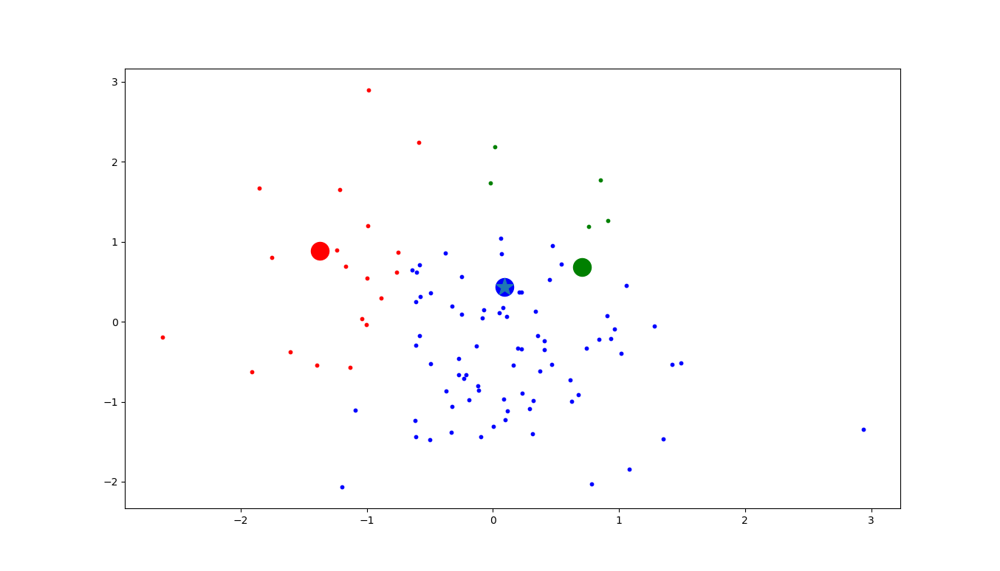

# TacticalVotingSim

So far this just consists of a neural network that tries to predict best strategy for each player based on 1) current best strategy 2)total of first place votes, and 3) average distance of the population from each candidate.

The neural network is trained by generating population data, computing by hand the optimal vote.  Each agent in the population, together with some other information in the training features, and the target is the optimal vote. The model is trained based partially on outputs from the model.   The goal is to find a general stable equilibrium in strategy - if each player updates their strategy based on their utility function which involves the strategy itself, does this process converge.  It appears that it does, although we played with a couple different network hyperparameters. Some converged, some didn't right away.   When they don't converge, they seem to be stuck at the "honest" voting strategy.  

To use it, run contents of the file up to 

train_model(TRAIN_ROUNDS, model2, POP_SIZE)

you can train for smaller time or cut the time. If you want to take a look generate a population and plot it as follows

test_pop = Population(200)

test_pop.plot(model2)

Note that I'm not using "Large Poisson Game" computation of pivot probabilities, rather, sample a few and compute the pivot probability directly using combinators.  

